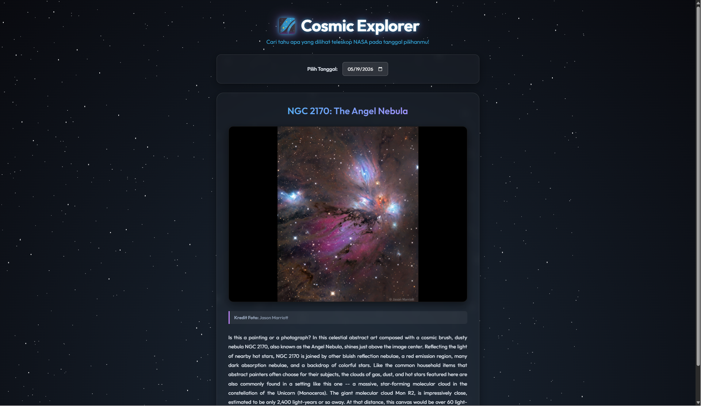

# 🌌 Cosmic Explorer

A modern space exploration web app built with React.js using the NASA Open API.  
Discover stunning astronomy pictures, space data, and cosmic events in real time.

---

## 🚀 Features

- 🪐 NASA Astronomy Picture of the Day (APOD)
- 🌠 Real-time space imagery from NASA API
- 🔭 Clean and responsive UI
- ⚛️ Built with React.js
- 🌐 No backend required (public API only)

---

## 🖼️ Preview



---

## 🌍 API Used

This project uses the free NASA Open API:

- APOD (Astronomy Picture of the Day)
- NASA Image Library (optional expansion)

API Documentation:
https://api.nasa.gov/

You can get your free API key here:
https://api.nasa.gov/#signUp

---

## ⚙️ Installation

Clone this repository:

```bash
git clone https://github.com/Artha444/CosmicExplorer.git
